# Aegis AI

> **Your always-on AI reviewer for faster, safer pull requests.**

[](../../actions)
[](LICENSE)
[](../../issues)
[](../../pulls)
[](../../stargazers)

<!-- Replace YOUR_GITHUB_USERNAME and the workflow filename above before publishing. -->

<p align="center">
  
</p>

<p align="center"><em>Screenshot placeholder — add <code>docs/images/aegis-dashboard.png</code>.</em></p>

## Overview

**Aegis AI** is an AI-assisted code-review platform for GitHub repositories. It receives pull-request events, analyses the changed code, produces focused review feedback, and gives teams a dashboard for reviewing activity and trends.

The project is meant to improve review coverage and shorten feedback loops. It is not a substitute for human review: generated feedback can be wrong, incomplete, or inappropriate for a repository’s conventions. Treat it as a second pair of eyes, then make the final decision as a developer.

## Key features

- **Pull-request reviews** — analyse changed files and publish structured feedback.
- **Line-level suggestions** — attach actionable comments to relevant code when context permits.
- **Severity and categories** — classify findings such as bugs, security, performance, maintainability, and style.
- **Repository-aware rules** — pass repository guidance, coding standards, and ignored paths into the review context.
- **GitHub webhook integration** — trigger reviews from pull-request events.
- **Review dashboard** — inspect recent reviews, findings, repositories, and activity.
- **Analytics** — track review volume, finding categories, and trends over time.
- **Human-in-control workflow** — configure approval, publishing, and exclusion behaviour to fit the team.

## Architecture

```mermaid
flowchart LR
    Dev[Developer opens or updates a PR] --> GH[GitHub]
    GH -->|pull_request webhook| API[Aegis API]
    API --> Verify[Webhook signature verification]
    Verify --> Queue[Review job queue]
    Queue --> Collector[Diff and repository-context collector]
    Collector --> Engine[AI review engine]
    Engine --> Policy[Policy and output validation]
    Policy --> Store[(Database)]
    Policy -->|review / comments| GH
    Store --> Dashboard[Web dashboard]
    Dashboard --> Team[Engineering team]
```



## How a review works

1. A contributor opens or updates a pull request.
2. GitHub sends a signed webhook to Aegis AI.
3. Aegis verifies the signature and creates a review job.
4. The job collects the pull-request diff and allowed repository context.
5. The AI review engine evaluates changes against your configured guidance.
6. Aegis validates and stores the output, then posts a review or draft feedback to GitHub.
7. The dashboard records the result for later inspection and analytics.

> Keep webhook payloads and repository context minimal. Sending secrets, customer data, or unreviewed production data to an external model provider is a security mistake, not a feature.

## Screenshots

| Dashboard | Pull-request review |
| --- | --- |
|  |  |
| Add a dashboard screenshot at `docs/images/dashboard-placeholder.png`. | Add a GitHub review screenshot at `docs/images/pr-review-placeholder.png`. |

## Getting started

### Prerequisites

- Git
- A supported runtime for this repository (for example, Node.js or Python)
- A GitHub account with permission to create a GitHub App or webhook
- An API key for the configured AI provider
- A database supported by the application, if persistence is enabled

### Installation

> This repository snapshot was not supplied with source files, so package commands and exact runtime versions cannot be stated honestly here. Replace this section with the project’s actual commands once its stack is fixed.

```bash
git clone https://github.com/YOUR_GITHUB_USERNAME/aegis-ai.git
cd aegis-ai

# Install dependencies using the project’s package manager.
# Examples: npm install | pnpm install | poetry install | pip install -r requirements.txt

# Copy configuration and fill in real values.
cp .env.example .env

# Apply database migrations if your app uses them.
# Start the API and dashboard using the scripts defined by the project.
```

Open the local dashboard URL printed by the application. For webhook testing, expose the local server through a secure tunnel and use that HTTPS URL in GitHub.

## Configuration

Create a `.env` file from `.env.example`. Never commit it.

| Variable | Required | Description |
| --- | :---: | --- |
| `APP_ENV` | No | Application environment, such as `development` or `production`. |
| `APP_URL` | Yes | Public base URL used by GitHub callbacks. |
| `DATABASE_URL` | If used | Connection string for the application database. |
| `GITHUB_APP_ID` | Yes | GitHub App identifier. |
| `GITHUB_PRIVATE_KEY` | Yes | GitHub App private key, usually stored securely rather than inline. |
| `GITHUB_WEBHOOK_SECRET` | Yes | Shared secret for verifying GitHub webhook signatures. |
| `AI_PROVIDER_API_KEY` | Yes | API key for the selected AI provider. |
| `AI_MODEL` | No | Model identifier to use for reviews. |
| `REVIEW_MAX_FILES` | No | Upper limit for files examined in one review. |
| `REVIEW_IGNORE_PATHS` | No | Comma-separated paths to skip, such as generated files. |
| `LOG_LEVEL` | No | Logging verbosity. |

Use a secret manager in deployment. Environment files are acceptable for local development only.

## Project structure

This is the recommended layout for Aegis AI. Adjust it to match the actual repository rather than pretending it already exists.

```text
aegis-ai/
├── apps/
│   ├── api/                 # Webhook receiver and API
│   └── dashboard/           # Web dashboard
├── packages/
│   ├── review-engine/       # Diff analysis and AI orchestration
│   ├── github-client/       # GitHub API integration
│   └── shared/              # Shared types, validation, utilities
├── db/                      # Schema, migrations, seed data
├── docs/
│   └── images/              # README screenshots and diagrams
├── tests/                   # Unit, integration, and end-to-end tests
├── .github/workflows/       # CI/CD workflows
├── .env.example
└── README.md
```

## API

Prefix application endpoints with your deployed base URL. Protect dashboard and administrative endpoints with authentication and authorization.

| Method | Endpoint | Purpose |
| --- | --- | --- |
| `GET` | `/health` | Liveness/readiness health check. |
| `POST` | `/webhooks/github` | Receives signed GitHub events. |
| `GET` | `/api/reviews` | Lists reviews, with pagination and filters. |
| `GET` | `/api/reviews/:id` | Returns one review and its findings. |
| `POST` | `/api/reviews/:id/retry` | Re-queues an eligible failed review. |
| `GET` | `/api/analytics/summary` | Returns dashboard summary metrics. |
| `GET` | `/api/repositories` | Lists connected repositories. |

### Example webhook flow

```http
POST /webhooks/github
X-GitHub-Event: pull_request
X-Hub-Signature-256: sha256=<signature>
Content-Type: application/json
```

Return a fast `2xx` response after verification and process the review asynchronously. Doing full model analysis inside the webhook request makes delivery retries and timeouts much more likely.

## Dashboard and analytics

The dashboard should answer practical questions, not produce decorative charts:

- How many reviews ran this week, and how many failed?
- Which repositories and pull requests have unresolved high-severity findings?
- What categories recur most often?
- How long does a review take from webhook receipt to publication?
- Is the tool generating useful feedback or mostly noise?

Recommended metrics:

| Metric | Why it matters |
| --- | --- |
| Reviews completed / failed | Shows operational reliability. |
| Median review latency | Shows whether feedback arrives while it is still useful. |
| Findings by severity and category | Reveals risk concentration and noise. |
| Dismissed / accepted findings | A proxy for feedback quality; interpret carefully. |
| Reviews by repository | Helps manage rollout and usage. |

## GitHub setup

### Preferred: GitHub App

1. Create a GitHub App in your organization or account settings.
2. Set the webhook URL to `https://YOUR_DOMAIN/webhooks/github`.
3. Generate a strong webhook secret and save it as `GITHUB_WEBHOOK_SECRET`.
4. Subscribe to the **Pull requests** event.
5. Grant only the permissions Aegis needs. Usually this includes Pull requests: Read & write, Contents: Read, and Metadata: Read.
6. Install the app only on repositories Aegis should review.
7. Store the App ID and private key in your deployment secret manager.

Avoid personal access tokens for a multi-repository product unless there is a narrow, temporary reason. GitHub Apps are scoped, auditable, and easier to revoke.

### Webhook validation

For every delivery:

- Verify `X-Hub-Signature-256` using constant-time comparison.
- Reject missing or invalid signatures.
- Check the event type and supported actions.
- Record the GitHub delivery ID to make processing idempotent.
- Return promptly and process the job in a worker.

## Testing

Use three layers of testing:

- **Unit tests** for diff parsing, prompt construction, validation, permissions, and signature verification.
- **Integration tests** for GitHub payload handling, database persistence, queue processing, and provider adapters.
- **End-to-end tests** for a complete pull-request event through to a rendered dashboard/review result.

Minimum checks before merging:

```text
formatting → lint → type checks → unit tests → integration tests → build
```

Mock AI-provider responses in normal CI. Real model calls are slow, nondeterministic, potentially expensive, and belong only in a deliberately controlled evaluation environment.

## CI/CD

A reliable pipeline should:

1. Run formatting, linting, type checks, tests, and build on every pull request.
2. Scan dependencies and secrets.
3. Publish a deployable artifact only from protected branches or tagged releases.
4. Run database migrations as a separate, observable deployment step.
5. Perform a health check after deployment and roll back on failure.

Example workflow layout:

```text
.github/workflows/
├── ci.yml          # Validate pull requests
├── security.yml    # Dependency and secret scanning
└── deploy.yml      # Controlled deployment
```

## Security notes

- Never log tokens, private keys, webhook payloads containing secrets, or raw source code by default.
- Validate GitHub signatures before queuing work.
- Limit access to repositories, models, database records, and dashboard users.
- Set strict size limits for diffs and context supplied to the model.
- Redact known secrets before external model calls, but do not mistake redaction for a complete data-security strategy.
- Use rate limits, idempotency keys, retry limits, and dead-letter handling for webhook jobs.

## Roadmap

- [ ] GitHub App installation flow
- [ ] Reliable asynchronous review queue
- [ ] Repository-level review policies and ignore rules
- [ ] Configurable severity thresholds
- [ ] Pull-request summary and line-level comments
- [ ] Team dashboard and review analytics
- [ ] Evaluation suite for precision, recall, and reviewer acceptance
- [ ] GitHub Actions and check-run integration
- [ ] Multi-provider AI support
- [ ] GitLab and Bitbucket integrations

## Contributing

Contributions are welcome when they improve correctness, safety, or usability.

1. Fork the repository and create a focused branch.
2. Make one coherent change at a time.
3. Add or update tests for behavioural changes.
4. Run the full local quality suite.
5. Open a pull request that explains the problem, solution, limitations, and verification.

Do not submit generated formatting churn, unrelated refactors, secrets, or undocumented breaking changes. Small, testable pull requests are easier to review and more likely to be merged.

See [CONTRIBUTING.md](CONTRIBUTING.md) for project-specific standards when it is added.

## License

This project is licensed under the [MIT License](LICENSE), unless the repository’s `LICENSE` file states otherwise.

## Author

Built and maintained by **Paras**.

- GitHub: [@parasbishnoi029](https://github.com/parasbishnoi029)

<!-- Replace the author and repository placeholders before publishing. -->

---

If Aegis AI saves your team time, consider starring the repository. More importantly, report false positives and missed issues—those signals are what make an AI reviewer useful.
