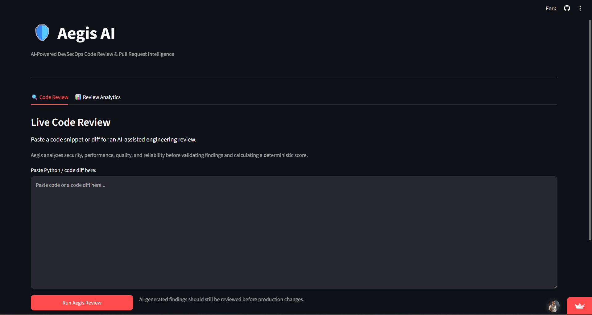
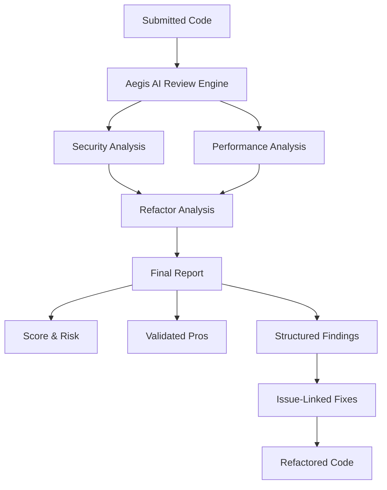
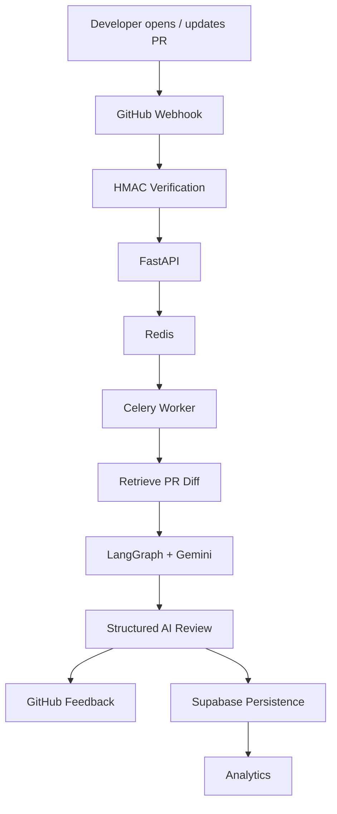
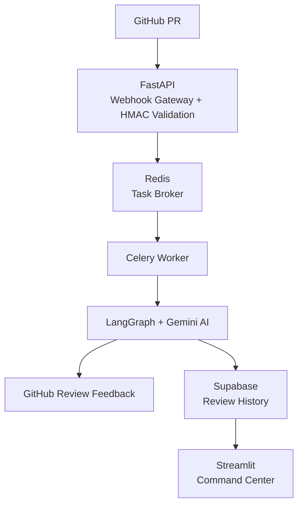

# 🛡️ Aegis AI

### AI-Powered DevSecOps Code Review & Pull Request Intelligence

[](LICENSE)
[](../../issues)
[](../../pulls)
[](../../stargazers)

<!-- A build badge is easy to add once you know the exact workflow filename
under .github/workflows/, e.g.:
[](../../actions) -->

Aegis AI is an AI-powered DevSecOps code review platform that analyzes source code and GitHub pull requests for **security, performance, reliability, and code-quality concerns**.

Powered by **Google Gemini and LangGraph**, Aegis AI transforms code into a structured engineering audit containing an **overall score, risk level, executive summary, validated strengths, severity-classified findings, confidence indicators, issue-linked fixes, and refactored code**.

The platform combines **FastAPI, LangGraph, Gemini, Celery, Redis, Supabase, Streamlit, and the GitHub API** to provide both interactive code analysis and automated pull-request reviews.

Aegis is meant to improve review coverage and shorten feedback loops. It is **not** a substitute for human review — generated feedback can be wrong, incomplete, or a poor fit for a repository's conventions. Treat it as a second pair of eyes, then make the final call as a developer.

---

## 📸 Screenshots

<p align="center">
  
</p>

<p align="center"><em>Add a real screenshot at <code>docs/images/aegis-dashboard.png</code> publishing.</em></p>

---

## ✨ Core Features

### 📊 Code Quality Scoring

Every review provides an overall score:

```text
Overall Score: 90 / 100
Risk Level: Low
```

The score gives developers a quick summary of the review before they inspect individual findings. It should be interpreted together with the detailed findings rather than treated as an absolute measurement of software quality.

---

### 📝 Executive Summary

Aegis AI generates a concise summary describing:

- Overall code quality
- Important security observations
- Performance characteristics
- Main engineering concerns
- General review outcome

Example:

```text
Executive Summary:

The code follows several strong security and asynchronous
programming practices, while a small number of reliability
and performance improvements may still be appropriate.
```

---

### 🌟 Validated Pros

Aegis AI identifies engineering practices that are already implemented well — input validation, secure coding patterns, asynchronous programming, error handling, resource management, and clear implementation patterns. This allows the review to distinguish between code that should be preserved and code that should be changed.

---

### 🚨 Structured Findings

Detected issues are presented using structured metadata:

```text
[LOW | Performance | Confidence: High]

Location:
check_server_status

Finding:
Creating a new network client for every invocation may
prevent connection reuse across repeated calls.
```

Each finding can contain a **severity**, **category**, **confidence**, **code location**, and **technical explanation**.

---

### 🛠️ Issue-Linked Fixes

Every recommendation is connected to the finding it addresses:

```text
🔧 Fix for check_server_status [Performance]

Consider reusing a long-lived HTTP client when the
function is called repeatedly so connections can be
reused across operations.
```

```text
Problem → Severity + Category → Confidence → Recommended Fix
```

---

### 💻 Refactored Code

For standalone snippets submitted through the Live Code Sandbox, Aegis AI can generate an improved implementation based on the review findings:

```text
Original Code → AI Analysis → Structured Findings → Issue-Linked Fixes → Refactored Code
```

Generated code should always be reviewed and tested before being used in production.

---

## 🔍 Live Code Sandbox

The Aegis AI Command Center provides an interactive environment for analyzing standalone code snippets. Paste code into the editor and run an AI-assisted review.

A complete review can contain:

```text
🛡️ Aegis AI Code Audit Report

📊 Executive Telemetry
Overall Score: 90 / 100
Risk Level: Low

Executive Summary:
[High-level analysis]

🌟 Validated Pros
✅ Good engineering practice
✅ Security or performance strength

🚨 Structured Findings & Cons
[LOW | AppSec | Confidence: Medium] Finding description...
[MEDIUM | Performance | Confidence: High] Finding description...

🛠️ Issue-Linked Fixes
🔧 Fix for finding #1...
🔧 Fix for finding #2...

💻 Validated Refactored Code
[Improved implementation]
```

---

## 🧠 Review Structure



### 📋 Review Report — five major sections

1. **📊 Executive Telemetry** — overall score, risk level, executive summary. Lets developers understand the general condition of the code at a glance.
2. **🌟 Validated Pros** — good engineering decisions already present. Aegis attempts to preserve these during refactoring.
3. **🚨 Structured Findings & Cons** — classified by:
   - **Severity**: Critical, High, Medium, Low
   - **Category**: AppSec, Performance, and other supported review categories
   - **Confidence**: High, Medium, Low
4. **🛠️ Issue-Linked Fixes** — recommendations connected directly to their corresponding findings, answering *what*, *where*, *how serious*, *how confident*, *why it matters*, and *how to improve it* — rather than just "this code has a problem."
5. **💻 Refactored Code** — for standalone code analysis, an improved version incorporating the recommended changes. This turns the system from a simple issue detector into an AI-assisted review and remediation workflow.

---

## 🔄 Automated GitHub PR Reviews

Aegis AI can also review GitHub pull requests automatically. Supported events:

```text
pull_request.opened
pull_request.synchronize
```



Heavy AI processing runs asynchronously in the Celery worker rather than inside the GitHub webhook request — this keeps webhook delivery fast and avoids GitHub's retry/timeout behavior on slow responses.

---

## 🏗️ System Architecture



---

## 📊 Command Center

Aegis AI includes a Streamlit-based Command Center with two main areas:

### 🔍 Live Code Sandbox

Submit standalone code and receive an overall score, risk level, executive summary, validated pros, structured findings (with severity, category, and confidence), issue-linked fixes, and refactored code.

### 📊 Analytics

The Analytics tab answers practical questions about review activity stored in Supabase, rather than showing decorative charts for their own sake:

- How many PRs has Aegis reviewed, and what's the average score?
- How many are high-risk, and how many repositories are covered?
- What's the average number of findings per PR, and the score range (highest / lowest)?
- What share of reviews come back low-risk (**Success Rate**)?
- Is the code-score trend improving or declining over time?
- Which severities and risk levels show up most often?
- How does each repository compare (review count, average score)?
- How fast are reviews running, on average and at best?
- What are the most recent reviews, filterable by repository and exportable to CSV?

---

## 🛠️ Technology Stack

| Technology | Role |
|---|---|
| **Python** | Core application language |
| **Google Gemini** | AI code analysis |
| **LangGraph** | Review workflow orchestration |
| **FastAPI** | API and GitHub webhook gateway |
| **Celery** | Background processing |
| **Redis** | Task broker |
| **Supabase** | Review persistence |
| **Streamlit** | Command Center dashboard |
| **GitHub API** | Pull-request integration |
| **Pydantic** | Structured AI output validation |
| **Pytest** | Automated testing |
| **GitHub Actions** | Continuous integration |

---

## 📂 Project Structure

```text
ai-reviewer/
│
├── .github/
│   └── workflows/
│
├── examples/
├── tests/
│
├── main.py
├── graph.py
├── tasks.py
├── dashboard.py
│
├── requirements.txt
├── .env.example
├── .gitignore
├── LICENSE
└── README.md
```

### `main.py`

FastAPI backend responsible for:
- GitHub webhook handling
- HMAC signature verification
- Manual review API
- API authentication
- Request validation

### `graph.py`

Contains the AI review workflow: security analysis, performance analysis, structured findings, severity classification, confidence classification, pros generation, refactoring, score/risk generation, and final report formatting.

### `tasks.py`

Handles asynchronous GitHub review operations: PR diff retrieval, AI review execution, GitHub feedback, and Supabase persistence.

### `dashboard.py`

Provides the Streamlit Command Center: Live Code Sandbox, review reports, code scores, risk levels, and analytics.

---

## 🚀 Getting Started

### 1. Clone the repository

```bash
git clone https://github.com/parasbishnoi029/ai-reviewer.git
cd ai-reviewer
```

### 2. Create a virtual environment

```bash
python -m venv venv
```

**Windows**
```bash
venv\Scripts\activate
```

**Linux / macOS**
```bash
source venv/bin/activate
```

### 3. Install dependencies

```bash
pip install -r requirements.txt
```

---

## ⚙️ Environment Configuration

Create a `.env` file from `.env.example`. **Never commit it, and never commit API keys, access tokens, webhook secrets, or production credentials.**

| Variable | Required | Description |
|---|:---:|---|
| `GOOGLE_API_KEY` | Yes | Gemini API key used by the review engine. |
| `GITHUB_TOKEN` | Yes | Token used for GitHub API access (posting reviews, fetching diffs). |
| `GITHUB_WEBHOOK_SECRET` | Yes | Shared secret used to verify incoming GitHub webhook signatures (HMAC SHA-256). |
| `API_KEY` | Yes | API key required to call the manual-review endpoint and used by the dashboard. |
| `REDIS_URL` | Yes | Redis connection string for the Celery task broker. |
| `SUPABASE_URL` | If analytics used | Supabase project URL for review persistence. |
| `SUPABASE_KEY` | If analytics used | Supabase key for review persistence. |
| `BACKEND_URL` | No | FastAPI base URL the dashboard calls (defaults to `http://127.0.0.1:8000`). |
| `LOG_LEVEL` | No | Logging verbosity for both the backend and dashboard (defaults to `INFO`). |

In production, prefer a secret manager or your host's secret store (e.g. Streamlit Cloud secrets) over a plain `.env` file.

---

## ▶️ Running Aegis AI

**Start Redis**
```bash
redis-server
```

**Start FastAPI**
```bash
uvicorn main:app --reload
```

**Start Celery**
```bash
celery -A tasks.celery_app worker --loglevel=info
```

**Start the Command Center**
```bash
streamlit run dashboard.py
```

Typical local endpoints:

```text
FastAPI:            http://localhost:8000
API Documentation:  http://localhost:8000/docs
Streamlit:          http://localhost:8501
```

---

## 🔗 GitHub Webhook Setup

```text
GitHub Repository → Settings → Webhooks → Add webhook
```

Configure:

```text
Payload URL: https://YOUR-DEPLOYED-API/github-webhook
```

Use the same secret configured in `GITHUB_WEBHOOK_SECRET`, and enable pull-request events.

For every delivery, Aegis:
- Verifies `X-Hub-Signature-256` using HMAC SHA-256.
- Rejects missing or invalid signatures.
- Processes the review asynchronously via Redis/Celery rather than inside the webhook request, so GitHub gets a fast response and doesn't retry on slow AI processing.

---

## 🧪 Testing

```bash
pytest tests/
```

GitHub Actions can automatically run repository checks on push and pull request. Expanding coverage (unit, integration, and end-to-end) and adding linting/type-checking to CI are tracked in the [Roadmap](#️-roadmap) below.

---

## 🔐 Security

Aegis AI includes several security controls already in place:

- **HMAC webhook authentication** — incoming GitHub webhooks are verified using HMAC SHA-256.
- **API authentication** — manual review requests require API-key authentication.
- **Request size limits** — large code submissions and PR diffs are restricted to reduce excessive AI workloads.
- **Network timeouts** — external API requests use explicit timeouts.
- **Structured AI responses** — important AI results are constrained using structured Pydantic models rather than relying entirely on free-form output.

General practices worth following as the project grows: avoid logging tokens, private keys, or raw source code by default; keep webhook payloads and repository context sent to the model minimal; and treat redaction of secrets before external model calls as a mitigation, not a complete data-security strategy.

---

## ✅ Current Capabilities

- [x] AI-assisted code review
- [x] Overall code quality score
- [x] Risk-level classification
- [x] Executive review summary
- [x] Validated pros
- [x] Security analysis
- [x] Performance analysis
- [x] Structured findings
- [x] Severity classification
- [x] Finding categories
- [x] Confidence classification
- [x] Issue-linked fixes
- [x] Refactored code generation
- [x] LangGraph workflow
- [x] Gemini integration
- [x] FastAPI backend
- [x] GitHub webhook integration
- [x] HMAC webhook validation
- [x] Automated PR reviews
- [x] Celery background processing
- [x] Redis task broker
- [x] Supabase persistence
- [x] Streamlit Command Center
- [x] Review analytics
- [x] Automated testing
- [x] GitHub Actions CI

---

## 🗺️ Roadmap

The next phase focuses on making reviews more context-aware, reliable, and actionable.

### AI Review Engine
- [ ] Parallel Security, Performance, Quality, and Testing agents
- [ ] Repository-aware context retrieval
- [ ] Related-file and dependency context
- [ ] Finding deduplication
- [ ] Better false-positive filtering
- [ ] Prompt-injection defenses
- [ ] Deterministic score calibration
- [ ] Review validation/evaluation stage

### GitHub Integration
- [ ] File and line-level findings
- [ ] Inline GitHub suggestions
- [ ] Automated PR verdicts
- [ ] Duplicate webhook protection
- [ ] Repository-specific `.aegis.yml` policies

### Platform Engineering
- [ ] Docker support
- [ ] Docker Compose
- [ ] Health and readiness endpoints
- [ ] Advanced Celery retry policies
- [ ] Idempotency keys and dead-letter handling for webhook jobs
- [ ] Rate limiting on public endpoints
- [ ] Expanded test coverage (unit, integration, end-to-end)
- [ ] Ruff linting
- [ ] Static type checking
- [ ] Dependency vulnerability scanning
- [ ] CI pipeline split into validate / security-scan / deploy stages

### Analytics
- [ ] Average review score
- [ ] Score history
- [ ] Risk distribution
- [ ] Severity distribution
- [ ] Finding-category trends
- [ ] Review latency
- [ ] Failure rate
- [ ] AI token usage
- [ ] Estimated AI cost

---

## ⚠️ Limitations

Aegis AI uses a large language model to assist with code analysis. AI-generated reviews can contain false positives, missed vulnerabilities, incorrect severity classifications, incorrect confidence estimates, unnecessary optimizations, incorrect refactoring recommendations, and imperfect quality scores.

Aegis AI should therefore be treated as an **engineering assistant**, not as a replacement for human code review, automated tests, static-analysis tools, dependency scanners, security testing, or professional security audits.

**Always inspect and test generated code before using it in production.**

---

## 🎯 Design Principle

> **AI should assist engineering judgment, not replace it.**

Aegis AI combines AI-assisted reasoning with conventional backend engineering to make code reviews faster, structured, and more actionable.

---

## 🤝 Contributing

Contributions and suggestions are welcome.

1. Fork the repository.
2. Create a focused feature branch.
3. Make one coherent change at a time — avoid bundling unrelated refactors or formatting churn.
4. Add or update tests for behavioral changes.
5. Open a pull request that explains the problem, the solution, and how you verified it.

---

## 📄 License

This project is licensed under the **MIT License**. See `LICENSE` for details.

---

## 👨‍💻 Author

**Paras**

GitHub: [@parasbishnoi029](https://github.com/parasbishnoi029)

---

## ⭐ Support

If you find Aegis AI useful, consider starring the repository. More importantly — report false positives and missed issues; those signals are what make an AI reviewer useful.

---

### 🛡️ Aegis AI

**Analyze. Score. Explain. Fix.**
